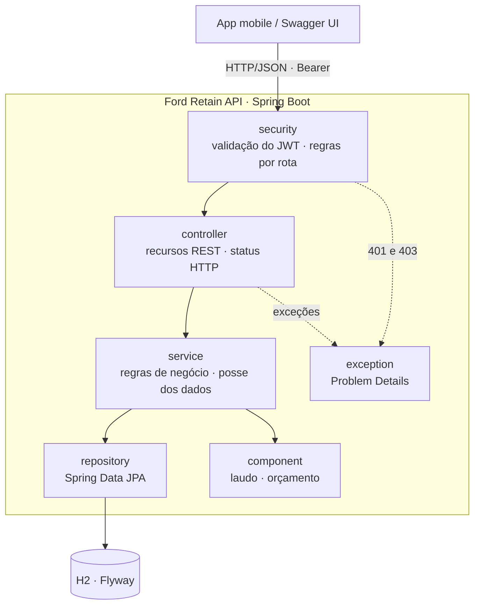
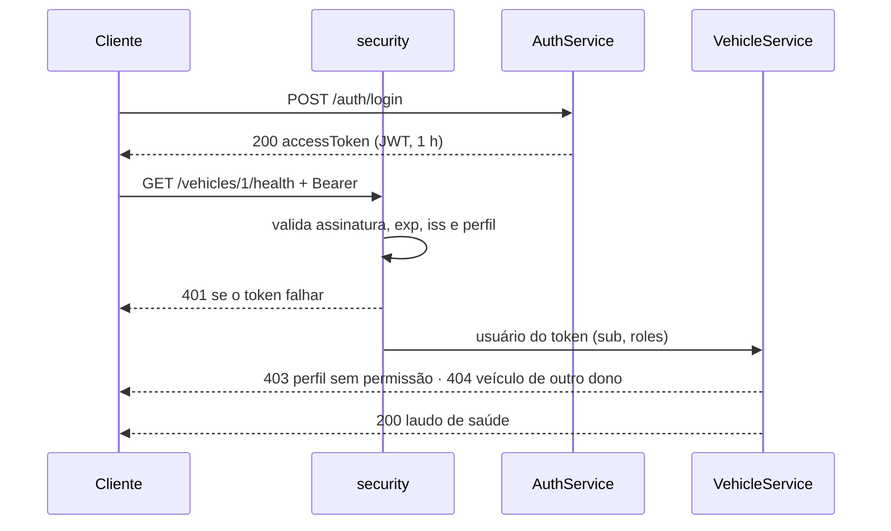

# Ford Retain API

API REST do Ford Retain, produto do desafio Ford x FIAP: saúde do veículo,
revisão recomendada e agendamento na rede Ford. Projeto separado do app mobile,
com as mesmas regras de negócio.


| Integrante | RM |
| --- | --- |
| Gustavo Morais | RM554972 |
| Leonardo Scarpitta | RM555460 |
| Murilo Justi | RM554512 |
| Vitor Eskes | RM555137 |

## Como executar

Requer JDK 17 ou superior. O banco H2 em memória é criado pelo Flyway e já sobe
com dados de demonstração.

```bash
./mvnw spring-boot:run      # Windows: mvnw.cmd spring-boot:run
```

- Swagger UI: http://localhost:8080/swagger-ui.html
- OpenAPI: http://localhost:8080/v3/api-docs

| Perfil | E-mail | Senha |
| --- | --- | --- |
| Cliente | `cliente@fordretain.com` | `Cliente@123` |
| Atendente (Ford Tatuapé) | `tatuape@fordretain.com` | `Concessionaria@123` |
| Administrador | `admin@fordretain.com` | `Admin@123` |

No Swagger, faça `POST /auth/login`, copie o `accessToken` e cole em
**Authorize**. Variáveis opcionais: `JWT_SECRET`, `JWT_EXPIRATION` (padrão
`1h`) e `DEMO_DATA` (padrão `true`).

## Arquitetura



| Camada | Responsabilidade |
| --- | --- |
| `controller` | Rotas, validação da entrada, perfil exigido e status da resposta |
| `service` | Regras de negócio, posse dos dados, transações e emissão do token |
| `component` | Cálculo do laudo de saúde e da revisão recomendada |
| `repository` | Acesso a dados com Spring Data JPA |
| `model` | Entidades JPA e enums de domínio |
| `dto` | Entrada validada (`request`) e formato das respostas (`response`) |
| `security` | Filtros, JWT e usuário autenticado |
| `exception` | Exceções de negócio e respostas de erro padronizadas |
| `config` | OpenAPI, relógio e dados de demonstração |

### Fluxo de autenticação



Os diagramas também estão em PNG em [docs/arquitetura](docs/arquitetura).

## Autenticação e autorização

| Perfil | Pode |
| --- | --- |
| `CUSTOMER` | Gerenciar os próprios veículos, ver laudo e orçamento, agendar e cancelar |
| `DEALER` | Abrir horários e conduzir os agendamentos da própria concessionária |
| `ADMIN` | Gerir concessionárias, novidades, contas e leituras dos componentes |

- **Públicos:** `POST /auth/register`, `POST /auth/login`, `GET /dealers/**`,
  `GET /news/**` e a documentação. Todo o resto exige token.
- **Controle em três níveis:** rotas no `SecurityConfig`, perfil com
  `@PreAuthorize` e posse do recurso nos services.
- **JWT HS256** com `sub` (id do usuário), `roles`, `dealerId` (atendente),
  `iss`, `iat`, `exp` e `jti`, válido por 1 hora. É recusado com 401 se a
  assinatura, a validade, o emissor ou o perfil não conferirem. Senhas ficam em
  BCrypt.

## Endpoints

| Recurso | Operações | Acesso |
| --- | --- | --- |
| `/auth/register`, `/auth/login` | `POST` | Público |
| `/users`, `/users/{id}`, `/users/me` | `GET`, `POST` | `ADMIN`; própria conta |
| `/vehicles`, `/vehicles/{id}` | `GET`, `POST`, `PUT`, `DELETE` | Dono, `ADMIN` |
| `/vehicles/{id}/health`, `/vehicles/{id}/service-quote` | `GET` | Dono, `ADMIN` |
| `/vehicles/{id}/components/{type}` | `PUT` | `ADMIN` |
| `/dealers`, `/dealers/{id}` | `GET` · `POST`, `PUT`, `DELETE` | Público · `ADMIN` |
| `/dealers/{id}/slots` | `GET` · `POST` | Público · `DEALER`, `ADMIN` |
| `/bookings`, `/bookings/{id}` | `GET`, `POST`, `PATCH` | Cliente cria e cancela; atendente confirma e conclui |
| `/news`, `/news/{id}` | `GET` · `POST`, `PUT`, `DELETE` | Público · `ADMIN` |

Status usados: `201` com `Location` na criação, `204` na remoção, `400`
entrada inválida, `401` sem token válido, `403` perfil sem permissão, `404`
inexistente ou de outro dono, `409` conflito (placa ou horário já usados,
transição inválida) e `422` regra de negócio (horário no passado).

## Erros

Todo erro, inclusive 401 e 403, segue o Problem Details (RFC 9457) com um
`code` estável:

```json
{
  "status": 409,
  "title": "Conflito",
  "detail": "Este horário já foi reservado. Escolha outro.",
  "instance": "/bookings",
  "code": "SLOT_UNAVAILABLE",
  "timestamp": "2026-09-26T21:50:25Z"
}
```

Erros de validação trazem também a lista `errors` com o campo e o motivo.

## Testes

```bash
./mvnw verify
```

99 testes, 0 falhas e 95,8% de cobertura de linhas: 77 de integração, que
passam pela segurança real com token do login, e 22 unitários das regras de
negócio. Cobrem sucesso, erro, 401 e 403. A evidência da execução, com o
resultado de cada cenário e o relatório do JaCoCo, está em
[docs/evidencias](docs/evidencias/resultado-testes.md), e o GitHub Actions roda
a suíte a cada push.

**Stack:** Java 17, Spring Boot 4.1, Spring Security 7 (OAuth2 Resource Server),
Spring Data JPA, H2, Flyway, springdoc-openapi, JUnit 6, MockMvc e JaCoCo.
