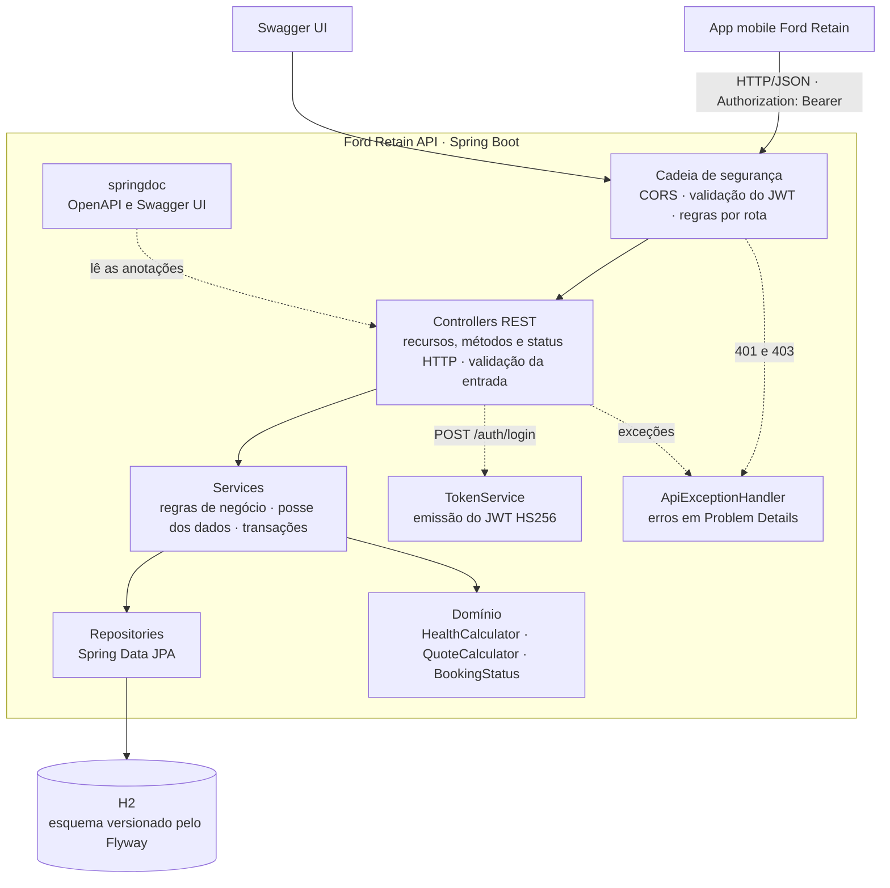
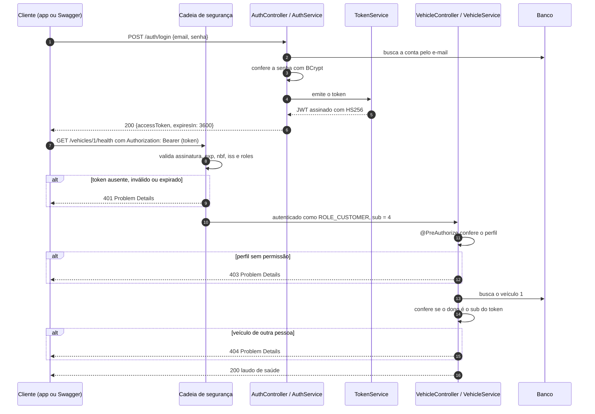
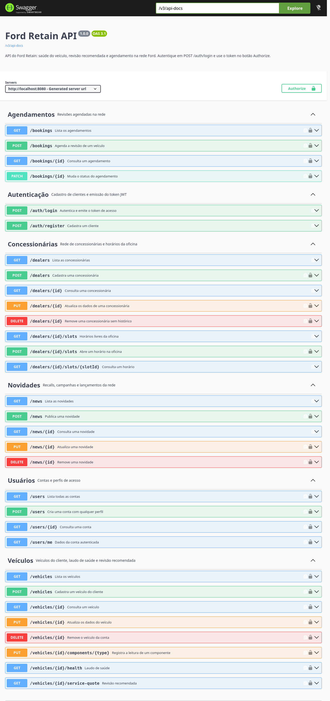

<div align="center">

# Ford Retain API

API REST do Ford Retain: saúde do veículo, revisão recomendada e agendamento na rede Ford.


[Como executar](#como-executar) · [Arquitetura](#arquitetura) · [Segurança](#autenticação-e-autorização) · [Endpoints](#endpoints) · [Testes](#testes-automatizados)

</div>

## Sobre

Backend do Ford Retain, produto do desafio Ford x FIAP. O app mobile mostra ao
dono do carro a saúde do veículo lida pelos módulos, avisa antes de um item
virar problema e agenda a revisão na concessionária com preço fechado. Esta API
atende o mesmo produto: é um projeto separado, sem integração com o app nesta
entrega, mas com as mesmas regras de negócio. O laudo da Ranger de demonstração
devolve exatamente os números exibidos no app (nota 67, motor 69, freios 60,
revisão de R$ 1.595).

| Integrante         | RM       |
| ------------------ | -------- |
| Gustavo Morais     | RM554972 |
| Leonardo Scarpitta | RM555460 |
| Murilo Justi       | RM554512 |
| Vitor Eskes        | RM555137 |

## Como executar

Requer apenas o **JDK 17 ou superior**. O Maven vem pelo wrapper (`mvnw`) e o
banco é um H2 em memória, criado pelo Flyway e populado com dados de
demonstração a cada inicialização.

```bash
./mvnw spring-boot:run          # Linux e macOS
mvnw.cmd spring-boot:run        # Windows
```

| Endereço | Conteúdo |
| --- | --- |
| http://localhost:8080/swagger-ui.html | Swagger UI para explorar e testar a API |
| http://localhost:8080/v3/api-docs | Especificação OpenAPI em JSON |
| http://localhost:8080/actuator/health | Situação da aplicação |

**Contas de demonstração**

| Perfil | E-mail | Senha |
| --- | --- | --- |
| Cliente (dono da Ranger) | `cliente@fordretain.com` | `Cliente@123` |
| Cliente (dono do Territory) | `ana.souza@fordretain.com` | `Cliente@123` |
| Atendente da Ford Tatuapé | `tatuape@fordretain.com` | `Concessionaria@123` |
| Atendente da Ford Aricanduva | `aricanduva@fordretain.com` | `Concessionaria@123` |
| Administrador da rede | `admin@fordretain.com` | `Admin@123` |

**Primeiros passos no Swagger:** execute `POST /auth/login` com uma das contas,
copie o `accessToken` da resposta, clique em **Authorize** e cole o token. A
partir daí, os endpoints protegidos respondem com as permissões daquele perfil.

O mesmo fluxo pela linha de comando:

```bash
TOKEN=$(curl -s -X POST localhost:8080/auth/login \
  -H 'Content-Type: application/json' \
  -d '{"email":"cliente@fordretain.com","password":"Cliente@123"}' | jq -r .accessToken)

curl -s localhost:8080/vehicles/1/health -H "Authorization: Bearer $TOKEN"
```

**Configuração por variáveis de ambiente**

| Variável | Padrão | Uso |
| --- | --- | --- |
| `JWT_SECRET` | segredo de desenvolvimento | Chave HMAC do token; em produção, pelo menos 32 caracteres aleatórios |
| `JWT_EXPIRATION` | `1h` | Validade do token (`30m`, `2h`...) |
| `DEMO_DATA` | `true` | Carrega os dados de demonstração |

## Arquitetura

A aplicação é um monólito em camadas, organizado por funcionalidade. Cada
módulo (`auth`, `user`, `vehicle`, `dealer`, `booking`, `news`) tem seu
controller, service, repository e DTOs; segurança, erros e documentação são
transversais.



| Componente | Responsabilidade |
| --- | --- |
| Cadeia de segurança (`security/SecurityConfig`) | Separa rotas públicas das protegidas, valida o token em toda requisição e converte o perfil do token em permissões |
| Controllers | Expõem os recursos, validam a entrada com Bean Validation e escolhem o status HTTP de cada resposta |
| Services | Aplicam as regras de negócio e a posse dos dados: cliente só vê o que é dele, atendente só o que é da sua concessionária |
| Regras de domínio (`vehicle/health`, `BookingStatus`) | Cálculo do laudo, montagem da revisão e ciclo de vida do agendamento, em código puro e testado isoladamente |
| Repositories | Acesso ao banco com Spring Data JPA; listagens com `@EntityGraph` para evitar consultas N+1 |
| `TokenService` e `JwtConfig` | Emitem e validam o JWT |
| `ApiExceptionHandler` | Traduz toda exceção, inclusive as de segurança, para o mesmo formato de erro |
| Flyway (`db/migration`) | Versiona o esquema do banco; o Hibernate só valida o mapeamento (`ddl-auto: validate`) |
| `DemoDataSeeder` | Popula concessionárias, agenda, contas, veículos e novidades quando o banco está vazio |

```
src/main/java/com/fordretain/api
├── auth/          cadastro e login
├── user/          contas e perfis
├── vehicle/       veículos e componentes
│   └── health/    laudo de saúde e revisão recomendada
├── dealer/        concessionárias e horários da oficina
├── booking/       agendamentos e ciclo de vida
├── news/          novidades da rede
├── security/      cadeia de filtros, JWT e usuário autenticado
├── common/error/  exceções de negócio e respostas de erro
├── config/        OpenAPI, relógio e MVC
└── seed/          dados de demonstração
```

### Fluxo de comunicação e autenticação



Os dois diagramas também estão em PNG em [docs/arquitetura](docs/arquitetura).

A API é **stateless**: não há sessão nem cookie. Cada requisição traz o token,
que carrega tudo o que é preciso para autorizar sem consultar o banco.

## Autenticação e autorização

O controle de acesso tem três camadas, cada uma com uma responsabilidade:

1. **Rotas** (`SecurityConfig`): define o que é público e exige token em todo o resto.
2. **Perfil** (`@PreAuthorize` nos controllers): restringe cada operação aos perfis permitidos.
3. **Posse** (services): confere se o recurso pertence a quem chama. Um cliente
   que pede o veículo de outra pessoa recebe 404, e não 403, para a API não
   confirmar que aquele recurso existe.

**Perfis**

| Perfil | Pode |
| --- | --- |
| `CUSTOMER` | Cadastrar e gerenciar os próprios veículos, ver o laudo e a revisão recomendada, agendar e cancelar revisões |
| `DEALER` | Abrir horários na própria concessionária, ver e conduzir os agendamentos dela (confirmar, concluir, cancelar) |
| `ADMIN` | Tudo o que é de gestão: concessionárias, novidades, contas de qualquer perfil, leitura dos componentes e visão de todos os dados |

**Endpoints públicos** (sem token): `POST /auth/register`, `POST /auth/login`,
`GET /dealers/**`, `GET /news/**`, a documentação OpenAPI e o health check.
Todo o resto exige token.

Senhas são guardadas com BCrypt. O login responde da mesma forma para e-mail
inexistente e senha errada, e roda o BCrypt nos dois casos, para não revelar
quais e-mails têm conta.

### JWT

O token é assinado com **HMAC-SHA256** (`HS256`), usando a chave de
`JWT_SECRET`. A aplicação recusa subir com uma chave menor que 32 bytes.

| Claim | Conteúdo | Uso |
| --- | --- | --- |
| `sub` | Id do usuário | Identifica quem chama; é a base da checagem de posse |
| `roles` | Perfil (`CUSTOMER`, `DEALER` ou `ADMIN`) | Vira a permissão `ROLE_*` usada no `@PreAuthorize` |
| `dealerId` | Concessionária do atendente | Restringe o atendente à própria concessionária |
| `iss` | `ford-retain-api` | Conferido na validação |
| `iat`, `nbf`, `exp` | Emissão, início e fim da validade | Validade padrão de 1 hora |
| `jti` | Id único do token | Rastreabilidade |
| `name`, `email` | Dados de exibição | Não são usados para autorizar |

Na validação, o token é recusado com **401** se a assinatura não confere, se
está expirado ou ainda não vale (com tolerância de 60 s para diferença de
relógio), se o emissor é outro ou se não traz perfil. Nenhum dado sensível
(senha ou hash) entra no token. Exemplo de payload:

```json
{
  "iss": "ford-retain-api",
  "sub": "4",
  "roles": ["CUSTOMER"],
  "name": "Vitor Alves",
  "email": "cliente@fordretain.com",
  "iat": 1790459404,
  "nbf": 1790459404,
  "exp": 1790463004,
  "jti": "ebe414ec-37fa-40b6-8522-2ab21bb2d379"
}
```

## Endpoints

A API segue o **nível 2 do modelo de maturidade de Richardson**: recursos
identificados por substantivos no plural, métodos HTTP com a semântica correta
e status codes coerentes com o resultado de cada operação.

| Método | Recurso | Acesso | Sucesso | Erros específicos |
| --- | --- | --- | --- | --- |
| `POST` | `/auth/register` | Público | 201 + `Location` | 400, 409 e-mail já cadastrado |
| `POST` | `/auth/login` | Público | 200 com o token | 400, 401 credenciais inválidas |
| `GET` | `/users/me` | Autenticado | 200 | 401 |
| `GET` | `/users/{id}` | Própria conta ou `ADMIN` | 200 | 403, 404 |
| `GET` | `/users` | `ADMIN` | 200 | 403 |
| `POST` | `/users` | `ADMIN` | 201 + `Location` | 400, 409, 422 perfil `DEALER` sem concessionária |
| `GET` | `/vehicles` | `CUSTOMER`, `ADMIN` | 200 | 403 |
| `POST` | `/vehicles` | `CUSTOMER` | 201 + `Location` | 400 placa inválida, 409 placa já cadastrada |
| `GET` | `/vehicles/{id}` | Dono ou `ADMIN` | 200 | 404 |
| `PUT` | `/vehicles/{id}` | Dono ou `ADMIN` | 200 | 400, 404, 422 quilometragem menor que a atual |
| `DELETE` | `/vehicles/{id}` | Dono ou `ADMIN` | 204 | 404, 409 revisão em aberto |
| `GET` | `/vehicles/{id}/health` | Dono ou `ADMIN` | 200 laudo de saúde | 404 |
| `GET` | `/vehicles/{id}/service-quote` | Dono ou `ADMIN` | 200 revisão recomendada | 404 |
| `PUT` | `/vehicles/{id}/components/{type}` | `ADMIN` | 200 | 400, 403, 404 |
| `GET` | `/dealers` | Público | 200 | |
| `GET` | `/dealers/{id}` | Público | 200 | 404 |
| `POST` | `/dealers` | `ADMIN` | 201 + `Location` | 400, 403 |
| `PUT` | `/dealers/{id}` | `ADMIN` | 200 | 400, 403, 404 |
| `DELETE` | `/dealers/{id}` | `ADMIN` | 204 | 403, 404, 409 com agendamentos ou atendentes |
| `GET` | `/dealers/{id}/slots` | Público | 200 horários livres | 404 |
| `GET` | `/dealers/{id}/slots/{slotId}` | Público | 200 | 404 |
| `POST` | `/dealers/{id}/slots` | `DEALER` da concessionária, `ADMIN` | 201 + `Location` | 403, 409 horário repetido, 422 horário no passado |
| `GET` | `/bookings` | Autenticado (recorte por perfil) | 200 | 401 |
| `POST` | `/bookings` | `CUSTOMER` | 201 + `Location` | 404, 409 horário ocupado ou veículo já agendado, 422 horário no passado |
| `GET` | `/bookings/{id}` | Dono, atendente da concessionária ou `ADMIN` | 200 | 404 |
| `PATCH` | `/bookings/{id}` | Cliente só cancela; atendente e `ADMIN` confirmam e concluem | 200 | 403, 404, 409 transição inválida |
| `GET` | `/news` | Público | 200 | 400 categoria inválida |
| `GET` | `/news/{id}` | Público | 200 | 404 |
| `POST` | `/news` | `ADMIN` | 201 + `Location` | 400, 403 |
| `PUT` | `/news/{id}` | `ADMIN` | 200 | 400, 403, 404 |
| `DELETE` | `/news/{id}` | `ADMIN` | 204 | 403, 404 |

Todo endpoint protegido responde **401** sem token válido. As convenções
seguidas:

- `GET` só lê e nunca altera estado; `POST` cria e responde **201** com o
  cabeçalho `Location` apontando para o novo recurso.
- `PUT` substitui os dados editáveis do recurso e é idempotente; `PATCH` altera
  uma parte, como o status do agendamento.
- `DELETE` responde **204** sem corpo.
- **400** para entrada malformada ou inválida, **401** para falta de
  autenticação, **403** para perfil sem permissão, **404** para recurso
  inexistente ou fora do alcance de quem chama, **409** para conflito com o
  estado atual e **422** para requisição válida que viola uma regra de negócio.

O ciclo de vida do agendamento é `REQUESTED` → `CONFIRMED` → `COMPLETED`, com
`CANCELLED` possível a partir dos dois primeiros. Cancelar devolve o horário à
agenda. A reserva de horário usa bloqueio otimista (`@Version`): duas reservas
simultâneas do mesmo horário não passam.

A especificação completa, com os schemas de cada requisição e resposta, está no
Swagger UI:



## Tratamento de erros

Toda resposta de erro segue o **Problem Details** (RFC 9457), com o tipo de
conteúdo `application/problem+json` e os mesmos campos em qualquer situação,
inclusive nos 401 e 403 gerados pela camada de segurança:

```json
{
  "status": 400,
  "title": "Requisição inválida",
  "detail": "Um ou mais campos são inválidos.",
  "instance": "/auth/register",
  "code": "VALIDATION_FAILED",
  "timestamp": "2026-09-26T21:50:04.912Z",
  "errors": [
    { "field": "email", "message": "deve ser um e-mail válido" },
    { "field": "password", "message": "deve ter entre 8 e 72 caracteres" }
  ]
}
```

O campo `code` é estável e serve para o cliente tratar cada caso sem depender
do texto da mensagem:

| Status | Códigos |
| --- | --- |
| 400 | `VALIDATION_FAILED`, `MALFORMED_REQUEST`, `INVALID_PARAMETER`, `MISSING_PARAMETER` |
| 401 | `AUTHENTICATION_REQUIRED`, `INVALID_TOKEN`, `INVALID_CREDENTIALS` |
| 403 | `ACCESS_DENIED` |
| 404 | `RESOURCE_NOT_FOUND` |
| 405 | `METHOD_NOT_ALLOWED` |
| 409 | `EMAIL_ALREADY_REGISTERED`, `PLATE_ALREADY_REGISTERED`, `SLOT_UNAVAILABLE`, `SLOT_ALREADY_EXISTS`, `VEHICLE_ALREADY_BOOKED`, `VEHICLE_HAS_ACTIVE_BOOKINGS`, `INVALID_STATUS_TRANSITION`, `DEALER_HAS_BOOKINGS`, `DEALER_HAS_USERS`, `CONCURRENT_UPDATE` |
| 415 | `UNSUPPORTED_MEDIA_TYPE` |
| 422 | `SLOT_IN_PAST`, `MILEAGE_DECREASED`, `DEALER_REQUIRED`, `DEALER_NOT_ALLOWED` |
| 500 | `INTERNAL_ERROR`, sem detalhes internos na resposta |

## Testes automatizados

```bash
./mvnw verify
```

O comando roda os 99 testes e gera os relatórios em `target/surefire-reports`
(resultado por teste) e `target/site/jacoco/index.html` (cobertura).

| Suíte | Tipo | Testes | O que cobre |
| --- | --- | --- | --- |
| Autenticação: cadastro e login | Integração | 9 | Cadastro, e-mail duplicado, validação, claims do token, credenciais inválidas |
| JWT: proteção dos recursos pelo token | Integração | 10 | Sem token, token expirado, adulterado, de outra chave, de outro emissor e sem perfil; endpoints públicos; 403 por perfil |
| Usuários e perfis | Integração | 6 | Conta própria, acesso a conta alheia, criação de atendente pelo administrador |
| Veículos, laudo e revisão recomendada | Integração | 16 | CRUD com os status corretos, posse entre clientes, laudo e orçamento da Ranger, leitura de componente |
| Agendamentos de revisão | Integração | 13 | Reserva, horário ocupado, horário no passado, recorte por perfil, confirmação, cancelamento e transições inválidas |
| Concessionárias e agenda da oficina | Integração | 11 | Cadastro, edição e remoção, agenda pública, horários abertos pelo atendente |
| Novidades da rede | Integração | 6 | Leitura pública, filtro, publicação restrita ao administrador |
| Padrão das respostas de erro | Integração | 6 | Formato Problem Details, JSON malformado, 404, 405 e 415 |
| Cálculo do laudo de saúde | Unitário | 10 | Limites de status, arredondamento da variação, pior status do sistema |
| Revisão recomendada | Unitário | 2 | Orçamento da Ranger e veículo sem serviço pendente |
| Ciclo de vida do agendamento | Unitário | 8 | Transições permitidas e proibidas |
| Configuração do JWT | Unitário | 2 | Chave curta e validade inválida recusadas |

Os testes de integração sobem a aplicação inteira e passam pela cadeia real de
segurança: o token vem de `POST /auth/login` e é validado pelo mesmo filtro da
produção. Eles não rodam dentro de uma transação com rollback, para que a
serialização das respostas aconteça como em produção; cada teste cria os
próprios dados para não depender da ordem de execução.

**Resultado:** 99 testes, 0 falhas, **95,8% de cobertura de linhas** e 84,3% de
ramos. A evidência completa da execução, com o resultado de cada cenário, está
em [docs/evidencias/resultado-testes.md](docs/evidencias/resultado-testes.md).
O workflow de CI (`.github/workflows/ci.yml`) roda a suíte a cada push e
publica o resumo na aba Actions do GitHub.


## Tecnologias

| Camada | Tecnologia |
| --- | --- |
| Linguagem e plataforma | Java 17, Spring Boot 4.1 |
| Web | Spring Web MVC, Bean Validation |
| Segurança | Spring Security 7, OAuth2 Resource Server (JWT com Nimbus), BCrypt |
| Dados | Spring Data JPA, Hibernate 7, H2, Flyway |
| Documentação | springdoc-openapi 3 (OpenAPI 3.1 e Swagger UI) |
| Testes | JUnit 6, MockMvc, Spring Security Test, AssertJ, JaCoCo |
| Operação | Spring Boot Actuator, GitHub Actions |

## Próximos passos

- Refresh token com rotação, para sessões longas no app sem aumentar a
  validade do token de acesso.
- Banco PostgreSQL em produção, reaproveitando as migrações do Flyway.
- Limite de tentativas no login.
- Integração com o app mobile, trocando os dados simulados do app pelos
  serviços HTTP que ele já prevê.
- Histórico de leituras por componente, para calcular a variação semanal a
  partir das leituras reais.
