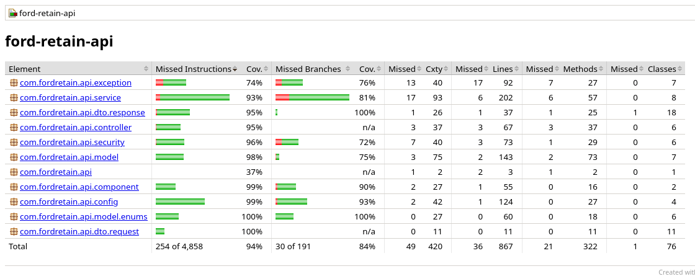

# Evidência de execução dos testes

Execução de `./mvnw clean verify` em 26/09/2026 às 20:12, com OpenJDK 17.0.20.1 2026-08-18, Spring Boot 4.1.1 e banco H2 em memória.

Para reproduzir, rode o mesmo comando na raiz do projeto: o resultado por teste fica em `target/surefire-reports` e o relatório de cobertura em `target/site/jacoco/index.html`.

## Resumo

| Indicador | Resultado |
| --- | --- |
| Testes executados | 99 |
| Testes de integração (aplicação completa via MockMvc) | 77 |
| Testes unitários (regras de negócio) | 22 |
| Falhas | 0 |
| Cobertura de linhas (JaCoCo) | 95,8% |
| Cobertura de instruções | 94,8% |
| Cobertura de ramos | 84,3% |



## Saída do Maven

```
[INFO] Tests run: 2, Failures: 0, Errors: 0, Skipped: 0, Time elapsed: 0.137 s -- in Configuração do JWT
[INFO] Tests run: 10, Failures: 0, Errors: 0, Skipped: 0, Time elapsed: 9.124 s -- in JWT: proteção dos recursos pelo token
[INFO] Tests run: 2, Failures: 0, Errors: 0, Skipped: 0, Time elapsed: 0.018 s -- in Revisão recomendada
[INFO] Tests run: 10, Failures: 0, Errors: 0, Skipped: 0, Time elapsed: 0.054 s -- in Cálculo do laudo de saúde
[INFO] Tests run: 8, Failures: 0, Errors: 0, Skipped: 0, Time elapsed: 0.009 s -- in Ciclo de vida do agendamento
[INFO] Tests run: 6, Failures: 0, Errors: 0, Skipped: 0, Time elapsed: 0.263 s -- in Padrão das respostas de erro
[INFO] Tests run: 6, Failures: 0, Errors: 0, Skipped: 0, Time elapsed: 0.241 s -- in Novidades da rede
[INFO] Tests run: 9, Failures: 0, Errors: 0, Skipped: 0, Time elapsed: 0.492 s -- in Autenticação: cadastro e login
[INFO] Tests run: 6, Failures: 0, Errors: 0, Skipped: 0, Time elapsed: 0.601 s -- in Usuários e perfis
[INFO] Tests run: 13, Failures: 0, Errors: 0, Skipped: 0, Time elapsed: 2.620 s -- in Agendamentos de revisão
[INFO] Tests run: 16, Failures: 0, Errors: 0, Skipped: 0, Time elapsed: 1.964 s -- in Veículos, laudo e revisão recomendada
[INFO] Tests run: 11, Failures: 0, Errors: 0, Skipped: 0, Time elapsed: 0.667 s -- in Concessionárias e agenda da oficina
[INFO] Tests run: 99, Failures: 0, Errors: 0, Skipped: 0
[INFO] BUILD SUCCESS
```

## Resultado por cenário

### Autenticação: cadastro e login

Integração · `com.fordretain.api.controller.AuthIntegrationTest` · 9 testes · 0.49 s

| Cenário | Resultado |
| --- | --- |
| Senha errada responde 401 sem emitir token | Passou |
| Cadastro público cria um cliente e responde 201 com Location | Passou |
| Token de atendente carrega a concessionária em dealerId | Passou |
| Cadastro inválido responde 400 com a lista de campos rejeitados | Passou |
| E-mail inexistente recebe a mesma resposta da senha errada | Passou |
| Cadastro com e-mail já existente responde 409 | Passou |
| Login válido emite JWT com sub, perfil, emissor e validade de 1 hora | Passou |
| Resposta do login informa tipo e validade do token | Passou |
| Login sem senha responde 400 | Passou |

### JWT: proteção dos recursos pelo token

Integração · `com.fordretain.api.security.JwtSecurityIntegrationTest` · 10 testes · 9.12 s

| Cenário | Resultado |
| --- | --- |
| Token com a assinatura adulterada responde 401 | Passou |
| Perfil sem permissão responde 403: atendente nos veículos dos clientes | Passou |
| Endpoints públicos respondem sem token | Passou |
| Recurso protegido sem token responde 401 com WWW-Authenticate | Passou |
| Token de outro emissor responde 401 | Passou |
| Perfil sem permissão responde 403: cliente na lista de usuários | Passou |
| Token assinado com outra chave responde 401 | Passou |
| Token válido dá acesso ao recurso protegido | Passou |
| Token sem perfil (roles) responde 401 | Passou |
| Token expirado responde 401 | Passou |

### Usuários e perfis

Integração · `com.fordretain.api.controller.UserIntegrationTest` · 6 testes · 0.60 s

| Cenário | Resultado |
| --- | --- |
| Atendente não cria contas (403) | Passou |
| Administrador cria atendente vinculado a uma concessionária | Passou |
| Administrador lista todas as contas | Passou |
| Atendente sem concessionária responde 422 | Passou |
| Conta autenticada consulta os próprios dados em /users/me | Passou |
| Cliente consulta a própria conta, mas não a de outra pessoa (403) | Passou |

### Veículos, laudo e revisão recomendada

Integração · `com.fordretain.api.controller.VehicleIntegrationTest` · 16 testes · 1.96 s

| Cenário | Resultado |
| --- | --- |
| Cliente não registra leitura de componente (403) | Passou |
| Cadastro de veículo responde 201 com Location e componentes aguardando leitura | Passou |
| Revisão recomendada da Ranger soma R$ 1.595 em peças e mão de obra | Passou |
| Laudo da Ranger: 67 geral, óleo e pastilha urgentes, sistemas com a variação da semana | Passou |
| Atualização do veículo responde 200 com os novos dados | Passou |
| Administrador enxerga qualquer veículo | Passou |
| Veículo recém-cadastrado tem os 10 componentes em dia | Passou |
| Placa já cadastrada responde 409 | Passou |
| Remoção responde 204 e o veículo deixa de existir | Passou |
| Placa fora do padrão responde 400 | Passou |
| Administrador registra a leitura de um componente e o laudo reflete a nova nota | Passou |
| Cliente não enxerga o veículo de outro cliente (404) | Passou |
| Veículo com revisão agendada não pode ser removido (409) | Passou |
| Leitura fora da faixa de 0 a 100 responde 400 | Passou |
| Quilometragem menor que a atual responde 422 | Passou |
| Cliente lista só os próprios veículos | Passou |

### Agendamentos de revisão

Integração · `com.fordretain.api.controller.BookingIntegrationTest` · 13 testes · 2.62 s

| Cenário | Resultado |
| --- | --- |
| Cliente agenda a revisão: 201 com Location, status REQUESTED e horário reservado | Passou |
| Veículo com revisão em aberto não agenda outra (409) | Passou |
| Veículo de outro cliente não pode ser agendado (404) | Passou |
| Atendente não cria agendamento em nome de cliente (403) | Passou |
| Agendamento cancelado não pode ser confirmado (409) | Passou |
| Atendente de outra concessionária não enxerga o agendamento (404) | Passou |
| Atendente confirma e depois conclui a revisão | Passou |
| Horário já reservado responde 409 | Passou |
| Cliente cancela e o horário volta a ficar livre | Passou |
| Horário no passado responde 422 | Passou |
| Status inexistente no corpo responde 400 | Passou |
| Cada perfil vê o seu recorte: cliente os próprios, atendente os da concessionária | Passou |
| Cliente não confirma o próprio agendamento (403) | Passou |

### Concessionárias e agenda da oficina

Integração · `com.fordretain.api.controller.DealerIntegrationTest` · 11 testes · 0.67 s

| Cenário | Resultado |
| --- | --- |
| Administrador cadastra concessionária: 201 com Location | Passou |
| Administrador atualiza e depois remove uma concessionária sem histórico | Passou |
| Nota fora da faixa de 0 a 5 responde 400 | Passou |
| Agenda pública traz só horários futuros e livres | Passou |
| Atendente não abre horário em outra concessionária (403) | Passou |
| Horário no passado responde 422 e horário repetido responde 409 | Passou |
| Lista de concessionárias é pública | Passou |
| Atendente abre horário na própria concessionária: 201 | Passou |
| Concessionária inexistente responde 404 | Passou |
| Concessionária com atendentes não pode ser removida (409) | Passou |
| Cliente não cadastra concessionária (403) | Passou |

### Novidades da rede

Integração · `com.fordretain.api.controller.NewsIntegrationTest` · 6 testes · 0.24 s

| Cenário | Resultado |
| --- | --- |
| Filtro por categoria devolve só a categoria pedida | Passou |
| Publicar sem token responde 401 | Passou |
| Categoria inexistente no filtro responde 400 | Passou |
| Lista de novidades é pública, da mais recente para a mais antiga | Passou |
| Cliente não publica novidade (403) | Passou |
| Administrador publica, edita e remove uma novidade | Passou |

### Padrão das respostas de erro

Integração · `com.fordretain.api.exception.ErrorResponseIntegrationTest` · 6 testes · 0.26 s

| Cenário | Resultado |
| --- | --- |
| Rota inexistente responde 404 no mesmo formato | Passou |
| Todo erro traz status, título, detalhe, código, instância e data no formato problem+json | Passou |
| Id com tipo errado na rota responde 400 | Passou |
| Content-Type diferente de JSON responde 415 | Passou |
| Método não suportado no recurso responde 405 | Passou |
| JSON malformado responde 400 com o código MALFORMED_REQUEST | Passou |

### Cálculo do laudo de saúde

Unitário · `com.fordretain.api.component.HealthCalculatorTest` · 10 testes · 0.05 s

| Cenário | Resultado |
| --- | --- |
| Reproduz o laudo da Ranger do app: 67 geral, com variação de -2 | Passou |
| A variação é a diferença entre as médias já arredondadas | Passou |
| Ordena os componentes de cada sistema do mais grave para o mais tranquilo | Passou |
| O status de um sistema é o pior entre os seus componentes | Passou |
| Converte a nota em status nos limites de 40 e 75 nota "0" -> "URGENT" | Passou |
| Converte a nota em status nos limites de 40 e 75 nota "39" -> "URGENT" | Passou |
| Converte a nota em status nos limites de 40 e 75 nota "40" -> "ATTENTION" | Passou |
| Converte a nota em status nos limites de 40 e 75 nota "74" -> "ATTENTION" | Passou |
| Converte a nota em status nos limites de 40 e 75 nota "75" -> "OK" | Passou |
| Converte a nota em status nos limites de 40 e 75 nota "100" -> "OK" | Passou |

### Revisão recomendada

Unitário · `com.fordretain.api.component.QuoteCalculatorTest` · 2 testes · 0.02 s

| Cenário | Resultado |
| --- | --- |
| Orça a revisão da Ranger em R$ 1.595 com 1h30 de serviço, como no app | Passou |
| Não recomenda revisão quando todos os componentes estão em dia | Passou |

### Ciclo de vida do agendamento

Unitário · `com.fordretain.api.model.enums.BookingStatusTest` · 8 testes · 0.01 s

| Cenário | Resultado |
| --- | --- |
| Permite só as transições do ciclo de vida "REQUESTED" -> "CONFIRMED": "true" | Passou |
| Permite só as transições do ciclo de vida "REQUESTED" -> "CANCELLED": "true" | Passou |
| Permite só as transições do ciclo de vida "REQUESTED" -> "COMPLETED": "false" | Passou |
| Permite só as transições do ciclo de vida "CONFIRMED" -> "COMPLETED": "true" | Passou |
| Permite só as transições do ciclo de vida "CONFIRMED" -> "CANCELLED": "true" | Passou |
| Permite só as transições do ciclo de vida "CONFIRMED" -> "REQUESTED": "false" | Passou |
| Permite só as transições do ciclo de vida "COMPLETED" -> "CANCELLED": "false" | Passou |
| Permite só as transições do ciclo de vida "CANCELLED" -> "CONFIRMED": "false" | Passou |

### Configuração do JWT

Unitário · `com.fordretain.api.security.JwtPropertiesTest` · 2 testes · 0.14 s

| Cenário | Resultado |
| --- | --- |
| Recusa segredo com menos de 32 bytes, fraco demais para o HS256 | Passou |
| Recusa validade zero ou negativa | Passou |
